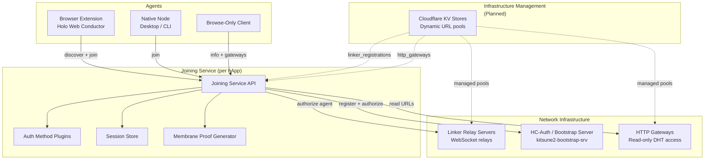
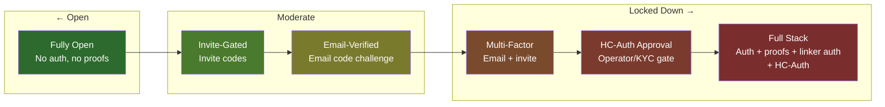
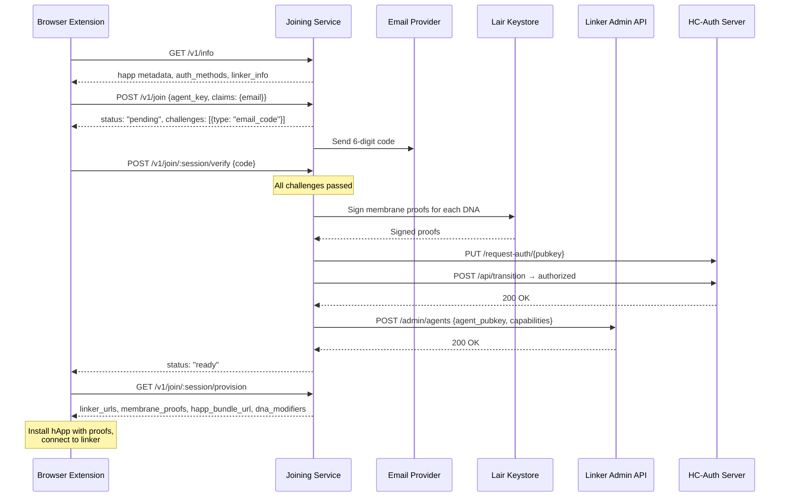
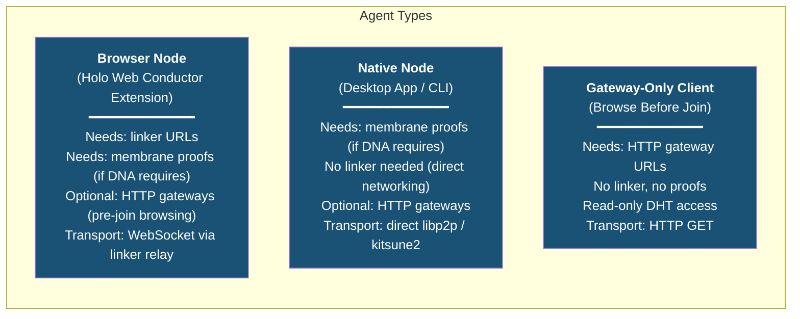
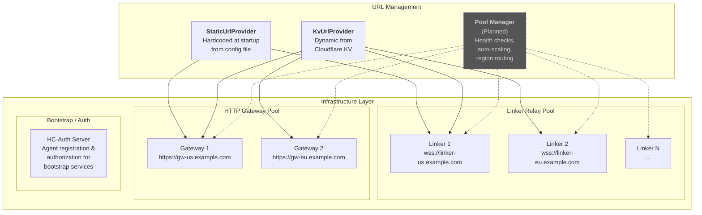
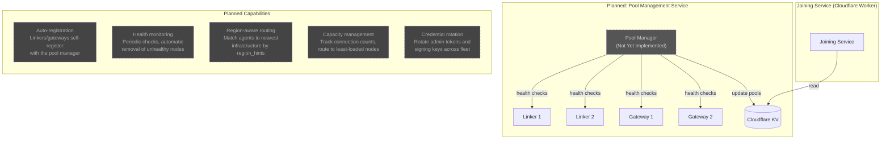
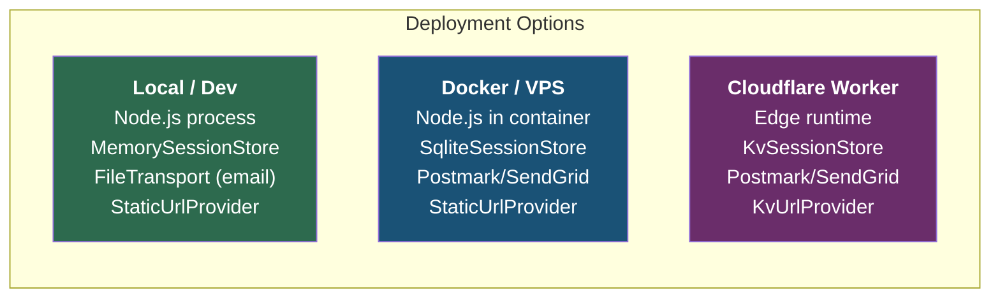
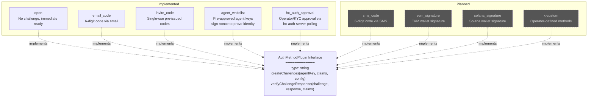
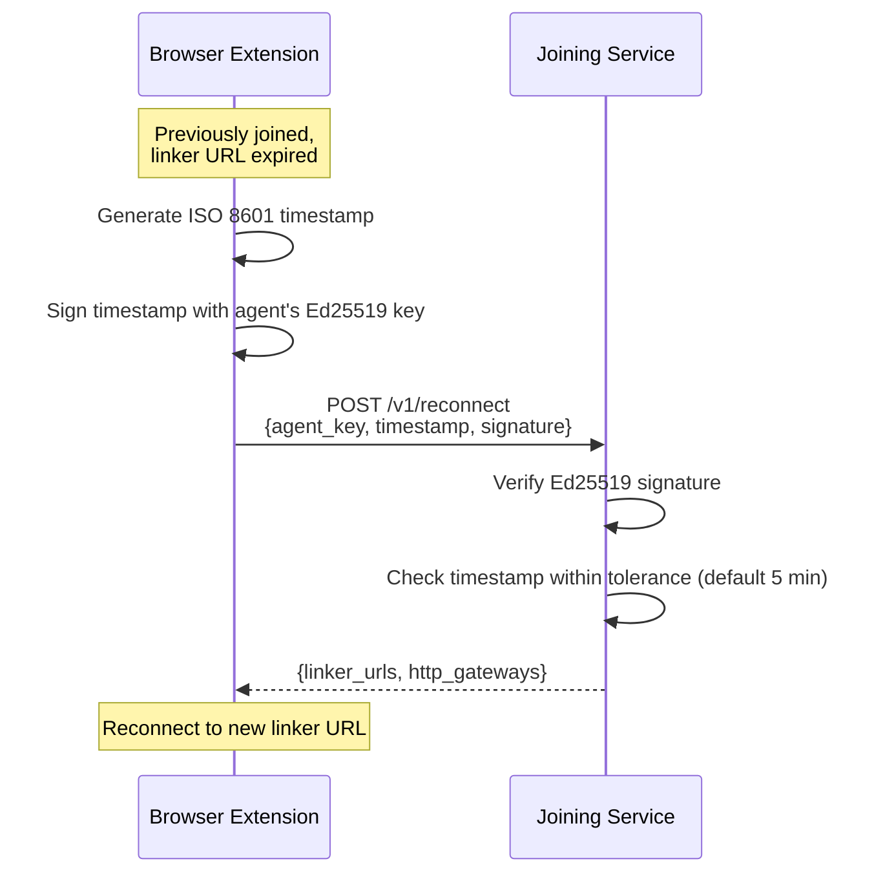

# Joining Service Architecture

This document describes the high-level architecture of the Joining Service, the different node types it supports, and the spectrum of configuration profiles from fully open to fully locked down.

---

## System Context

The Joining Service is a per-hApp REST API that brokers onboarding for Holochain applications running in the Holo ecosystem. It sits between agents (browser extensions, native apps) and the network infrastructure (linkers, bootstrap servers, gateways), controlling who can join and what credentials they receive.

---

## Configuration Spectrum

The joining service supports a range of deployment profiles. Each capability is independently optional—operators compose only what their hApp needs.

### Profile 1: Fully Open

No authentication, no membrane proofs. Any agent can join immediately.

| Setting | Value |
|---------|-------|
| `auth_methods` | `['open']` |
| `membrane_proof` | not configured |
| `hc_auth` | not configured |
| `linker_auth` | not configured |

**Use cases**: Public test networks, open hApps, local development.

**Flow**: `POST /v1/join` → immediate `status: "ready"` → `GET /provision` returns linker URLs and bundle URL.

---

### Profile 2: Invite-Gated

Single-use invite codes control who can join. No ongoing identity verification.

| Setting | Value |
|---------|-------|
| `auth_methods` | `['invite_code']` |
| `invite_codes` | `['CODE1', 'CODE2', ...]` |
| `membrane_proof` | optional |

**Use cases**: Beta programs, limited rollouts, paid access (codes issued after payment externally).

**Flow**: `POST /v1/join` with `claims: { invite_code: "CODE1" }` → auto-verified at join time → `status: "ready"` or `status: "rejected"`.

---

### Profile 3: Email-Verified

Agent must prove control of an email address via 6-digit code.

| Setting | Value |
|---------|-------|
| `auth_methods` | `['email_code']` |
| `email` | provider + api_key + from + template |
| `membrane_proof` | optional |

**Use cases**: Consumer apps requiring identity, apps needing contact info for notifications.

**Flow**: `POST /v1/join` with `claims: { email: "user@example.com" }` → `status: "pending"` with challenge → user receives email → `POST /verify` with code → `status: "ready"`.

---

### Profile 4: Multi-Factor

Multiple auth methods combined. Top-level entries are AND'd; `{ any_of: [...] }` entries create OR groups where any one method suffices.

| Setting | Value |
|---------|-------|
| `auth_methods` | `['invite_code', { any_of: ['email_code', 'sms_code'] }]` |
| `email` | configured |
| `invite_codes` | configured |
| `membrane_proof` | optional |

**Use cases**: Higher-trust networks, regulated applications, user-choice verification channels.

**Flow**: Invite code verified at join time. Email and SMS challenges issued as OR alternatives (same `group` id). Agent verifies whichever channel they prefer to reach `status: "ready"`.

### Profile 4b: Agent Whitelist

Pre-approved agent keys sign a nonce to prove identity. Can be standalone or combined with other methods in OR groups.

| Setting | Value |
|---------|-------|
| `auth_methods` | `['agent_whitelist']` or `[{ any_of: ['agent_whitelist', 'invite_code'] }]` |
| `allowed_agents` | `['uhCAk...', 'uhCAk...']` |
| `membrane_proof` | optional |

**Use cases**: Known-participant networks, testing with specific agent keys, fallback to invite codes for new agents.

**Flow**: `POST /v1/join` checks if `agent_key` is in the allow list. If yes, returns a nonce challenge. Agent signs the nonce with their ed25519 key and submits via `POST /verify`. If in an OR group with other methods, non-whitelisted agents can use the alternatives.

### Profile 4c: HC-Auth Approval

Delegates join decisions to the hc-auth server. The agent is registered as pending and an operator (or external KYC provider) approves or blocks them via the hc-auth ops console. The client polls `/status` until the decision is made. Revocation checks are enforced at provision and reconnect time.

| Setting | Value |
|---------|-------|
| `auth_methods` | `['hc_auth_approval']` or combined in OR groups |
| `hc_auth` | configured (server URL + credentials) |
| `membrane_proof` | optional |

**Use cases**: Operator-gated networks, KYC-required apps, manual review workflows.

**Flow**: `POST /v1/join` registers agent as pending in hc-auth → `status: "pending"` with `hc_auth_approval` challenge → client polls `GET /status` → operator approves via hc-auth console → next poll returns `status: "ready"`. If blocked, returns `status: "rejected"`.

---

### Profile 5: Full Stack (Maximum Security)

All authorization layers active. Agent must pass auth challenges, receives signed membrane proofs, gets authorized on linker admin API, and gets registered with HC-Auth bootstrap server.

| Setting | Value |
|---------|-------|
| `auth_methods` | `['email_code']` (or any combination, including OR groups and `agent_whitelist`) |
| `membrane_proof.enabled` | `true` |
| `membrane_proof.signing_key_path` | path to persistent key |
| `hc_auth.required` | `true` |
| `linker_auth.required` | `true` |
| `linker_auth.capabilities` | `['dht_read', 'dht_write', 'k2']` |

**Use cases**: Production Holo-hosted apps with full infrastructure control.

**Flow**:

---

## Node Types

### Browser Node (HWC Extension)
The primary use case. The browser extension cannot run a full Holochain node directly, so it connects through a **linker relay server** via WebSocket. The joining service provides:
- Linker URLs (assigned or client-choice)
- Membrane proofs (signed by the service's progenitor key)
- hApp bundle URL for installation
- DNA modifiers (network seed, properties)

### Native Node
Desktop or CLI-based Holochain nodes that handle their own networking. They only need the joining service for membrane proofs (if the DNA's `genesis_self_check` enforces membership). Linker URLs are unnecessary since native nodes connect directly via kitsune2.

### Gateway-Only Client
A read-only access mode for clients that want to browse DHT data before committing to join. Uses HTTP gateway endpoints to read zome calls without installing the hApp. No authentication required for gateway access (the gateways themselves are public read endpoints).

---

## Infrastructure Services

### Linker Relay Servers
WebSocket relay servers (`h2hc-linker`) that route Holochain messages for browser-based nodes. Each linker can optionally have an **admin API** that the joining service calls to pre-authorize agents with specific capabilities (`dht_read`, `dht_write`, `k2`).

- **Open linkers**: No admin API, any agent can connect.
- **Authorized linkers**: Admin API with bearer token. Joining service calls `POST /admin/agents` to whitelist agent keys.

### HTTP Gateways
Read-only HTTP endpoints that proxy zome calls against the DHT. Used for browse-before-join UX. Each gateway entry includes:
- URL
- Which DNA hashes it serves
- Health status (`available` / `degraded` / `offline`)
- Optional expiration

### HC-Auth Server
Central authorization gate for bootstrap/discovery services (kitsune2-bootstrap-srv). The joining service registers agents and transitions them to `authorized` state, allowing them to use bootstrap infrastructure.

---

## Planned: Infrastructure Pool Management via Cloudflare KV

The `KvUrlProvider` and `KvSessionStore` lay groundwork for a dynamic infrastructure management layer. This is partially implemented (KV reads work) but the management/orchestration side is not yet built.

### What exists today
- **KvUrlProvider**: Reads `linker_registrations` and `http_gateways` keys from Cloudflare KV at request time. No redeployment needed to change URLs.
- **KvSessionStore**: Persists sessions to Cloudflare KV with native TTL-based expiration.
- **LinkerRegistration**: Each linker entry can include admin URL + bearer token for authorized access.
- **HttpGateway**: Each gateway entry includes health status and optional expiration.

### What is not yet built
- **Pool Manager service**: No orchestration layer manages the KV entries. Today they are written manually or by external tooling.
- **Health checks**: No automated monitoring of linker/gateway health.
- **Auto-registration**: Linkers and gateways don't self-register; URLs must be manually added to KV.
- **Region routing**: `region_hints` field exists in config but no matching logic routes agents to nearby infrastructure.
- **Capacity tracking**: No connection counting or load-aware routing.
- **Credential rotation**: Signing keys and admin tokens are static after deployment.

---

## Deployment Targets

| Component | Local/Dev | Docker/VPS | Cloudflare Worker |
|-----------|-----------|------------|-------------------|
| Runtime | Node.js | Node.js | Workers runtime |
| Session store | Memory | SQLite (file) | Cloudflare KV |
| Email transport | File (writes .txt) | Postmark or SendGrid | Postmark or SendGrid |
| URL provider | Static | Static | KV (dynamic) |
| Config source | JSON file | JSON file | Environment vars + secrets |
| Scaling | Single instance | Single instance | Edge (multi-region) |

---

## Auth Method Plugin Architecture

Auth methods are composable plugins. Top-level entries in `auth_methods` are AND'd together. An `{ any_of: [...] }` entry creates an OR group where the agent must satisfy at least one method in the group.

Example: `["invite_code", { "any_of": ["email_code", "sms_code"] }]` requires an invite code AND either email or SMS verification.

---

## Reconnect Flow

Separate from joining. For agents that have already joined but need fresh linker URLs (e.g., after URL expiration or network reconnection).

No re-authentication required. The agent proves identity by signing a timestamp with their agent key.
